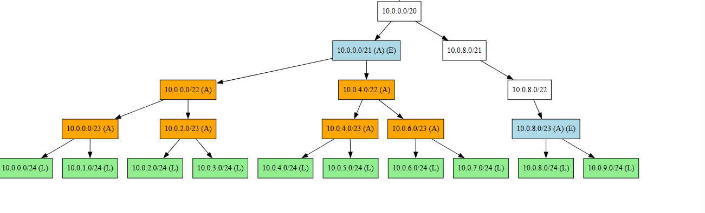
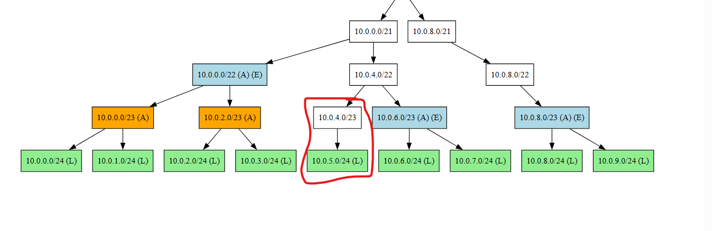

# IP Aggregation Library

A high-performance, incremental **Trie-based IP aggregation library** for IPv4 and IPv6.

It’s built for real-world scenarios where prefixes are constantly added and withdrawn — such as BGP, network telemetry pipelines, or offline aggregation tasks.

**Key highlights:**

* Handles large datasets (millions of prefixes).
* **Builds and aggregates a 1M-node trie in ~2.15 seconds**, and **aggregates the full IPv4 (3.26 s) and IPv6 (1.09 s) internet routing tables (FIRT)** on a standard desktop.
* Performs incremental add/remove operations in **microseconds — faster than a packet round trip**.
* Supports **BGP prefix aggregation with attribute synthesis**.
* FIRT data sourced from [IPv4](https://bgp.potaroo.net/as2.0/bgp-active.html) and [IPv6](https://bgp.potaroo.net/v6/as2.0/index.html).

See the [Benchmarking](#4-benchmarking-what-was-measured) section for detailed performance metrics.

---


## 1. Why IP Aggregation?

IP aggregation (a.k.a. route summarization) compresses multiple IP prefixes into a smaller set of prefixes without changing the union of covered IP addresses. Where it's useful:

* **BGP route aggregation**: reduce RIB/FIB pressure, lower BGP churn, and limit route advertisement explosion.
* **Routing table management**: compress large lists of operational prefixes (private estate, cloud tenants) into manageable summaries.
* **Access control / CIDR management**: find minimal covering sets for ACLs, firewall rules, or IP whitelists.


Important: This library performs aggregation only when the resulting prefixes exactly cover the same IP address space as the input prefixes. It does not perform lossy aggregation (which may cover more addresses than the input prefixes).


---

## 2. Trie-based approach (overview)

This implementation uses a **binary trie** where each node represents a prefix. Traversal is bit-by-bit down to a mask length. Key points:

* Each `TrieNode` has two children: `children[0]` (next bit = 0) and `children[1]` (next bit = 1).
* Nodes carry state flags: `IsLeaf`, `IsAggregate`, `IsExported`, and `IsSubTreeChanged`.
* `IPPrefix` is the prefix payload. `BgpPrefix` extends it with BGP attributes; aggregation attempts may produce attribute-aware aggregates.

### High-level algorithm (pointers only)

* **PerformOperations** → Orchestrates add/remove and re-computation.
* **AddPrefix** → Walk down trie, create missing nodes, mark leaf, bubble up to check aggregation.
* **RemovePrefix** → Unset leaf, prune unnecessary nodes, update aggregates.
* **ReComputeAffectedNodes** → DFS re-evaluating which aggregates to export or withdraw.
* **CanThisNodeBeAggregated** → Simple check: both children are leaves/aggregates; for `BgpPrefix`, attempt attribute synthesis.

Why a trie?

* Incremental updates touch only O(mask length) nodes.
* Supports attribute-aware aggregation.
* Ensures deterministic exported set.

### Acknowledgment

This work is **inspired by the ORTC algorithm** described in the research paper:

> Yaoqing Liu, Xin Zhao, Kyuhan Nam,  Lan Wang and Beichuan Zhang, *“Incremental Forwarding Table Aggregation”*
> [Paper link](https://www2.cs.arizona.edu/~bzhang/paper/10-globecom-ortc.pdf)

The actual implementation here is different and adapted for incremental, streaming updates, but the foundational idea is credited to the authors.

---

## 3. Visualizing the trie

The library provides `TrieNode.ToDotGraphFile(path)` which emits a DOT graph. This lets you visually inspect aggregation behavior. The code can be extended to emit a dot graph for each iteration to visualize animation of the aggregation process.


### Node color legend

<p><span style="background-color: lightgreen; padding: 2px 6px; border-radius: 3px;">L</span> — Leaf node (IsLeaf)</p>
<p><span style="background-color: orange; padding: 2px 6px; border-radius: 3px;">A</span> — Aggregate node (IsAggregate)</p>
<p><span style="background-color: lightblue; padding: 2px 6px; border-radius: 3px;">E</span> — Exported node (IsExported)</p>
<p><span style="background-color: white; padding: 2px 6px; border-radius: 3px;">No color</span> — Non-leaf, non-aggregate, non-exported node</p>


### Example usage

The below pic shows a trie after adding several `/24` prefixes under `10.0.0.0/20`.



The below pic shows the trie after withdrawing `10.0.4.0/24`:




```csharp
public static void VisualizeTrie()
{
    var trie = new TrieNode(new IPPrefix("0.0.0.0/0"));
    var aggregatesAdded = new List<IPPrefix>();
    var withdrawnPrefixes = new List<IPPrefix>();

    // Step 1: Add /24s — partial aggregation expected
    trie.PerformOperations(
        new List<IPPrefix> {
            new IPPrefix("10.0.0.0/24"),
            new IPPrefix("10.0.1.0/24"),
            new IPPrefix("10.0.2.0/24"),
            new IPPrefix("10.0.3.0/24"),
            new IPPrefix("10.0.4.0/24"),
            new IPPrefix("10.0.5.0/24"),
            new IPPrefix("10.0.6.0/24"),
            new IPPrefix("10.0.7.0/24"),
            new IPPrefix("10.0.8.0/24"),
            new IPPrefix("10.0.9.0/24")
        },
        new List<IPPrefix>(),
        aggregatesAdded,
        withdrawnPrefixes);

    trie.ToDotGraphFile("trie_step1.dot");

    // Withdraw one /24 and re-emit DOT
    trie.PerformOperations(
        new List<IPPrefix>(),
        new List<IPPrefix>{ new IPPrefix("10.0.4.0/24") },
        aggregatesAdded,
        withdrawnPrefixes);

    trie.ToDotGraphFile("trie_step2.dot");
}
```

Once you have `.dot` files, render them with:

```bash
dot -Tpng trie_step1.dot -o trie_step1.png
```

(or)

you can use online tools like [GraphVizOnline](https://dreampuf.github.io/GraphvizOnline/?engine=dot) to visualize directly in your browser.

---

## 4. Benchmarking (what was measured)

Benchmarks are implemented with **BenchmarkDotNet** and measure:

* Bulk insert performance (N prefixes inserted from scratch).
* Incremental add/remove throughput (streaming scenario).
* Real-world performance on the **full internet routing table (FIRT)**.

### Benchmark environment

```
BenchmarkDotNet v0.15.2, Windows 11 (10.0.22631.5909/23H2/2023Update/SunValley3)
Intel Xeon Platinum 8370C CPU 2.80GHz (Max: 2.79GHz), 1 CPU, 16 logical and 8 physical cores
.NET SDK 9.0.305
[Host]     : .NET 8.0.20 (8.0.2025.41914), X64 RyuJIT AVX-512F+CD+BW+DQ+VL+VBMI
Job-YTMLKF : .NET 8.0.20 (8.0.2025.41914), X64 RyuJIT AVX-512F+CD+BW+DQ+VL+VBMI
Runtime=.NET 8.0  Arguments=/nowarn:CS1591
```

### Performance on typical datasets

| Method                      |     Mean |    Error |   StdDev |       Gen0 |       Gen1 |      Gen2 | Allocated |
| --------------------------- | -------: | -------: | -------: | ---------: | ---------: | --------: | --------: |
| CreateTrieWith1MillionNodes |  2.148 s | 0.0238 s | 0.0199 s | 29000.0000 | 27000.0000 | 2000.0000 | 648.51 MB |
| Remove100NodesIncrementally | 97.31 us | 53.74 us | 50.27 us |          - |          - |         - |  10.47 KB |

---

### Performance on Full Internet Routing Table (FIRT)

The library efficiently handles the **complete IPv4 and IPv6 internet routing tables**, performing full aggregation in **seconds**, demonstrating real-world readiness for BGP and network telemetry pipelines.

**IPv4 FIRT:**

* Entries: 1,028,861
* Aggregated: 88,602

**IPv6 FIRT:**

* Entries: 235,850
* Aggregated: 24,006

| Method           |    Mean |    Error |   StdDev |       Gen0 |       Gen1 |      Gen2 | Allocated |
| ---------------- | ------: | -------: | -------: | ---------: | ---------: | --------: | --------: |
| CreateV4FirtTrie | 3.258 s | 0.0608 s | 0.0624 s | 48000.0000 | 44000.0000 | 2000.0000 |   1.08 GB |
| CreateV6FirtTrie | 1.087 s | 0.0115 s | 0.0102 s | 20000.0000 | 19000.0000 | 2000.0000 |    434 MB |

> ⚡ These results show that the library **scales efficiently to millions of prefixes**, making it suitable for high-performance BGP aggregation, real-time telemetry, and other large-scale network applications.
---

## 5. Unit tests

The test suite (MS Test) includes:

* Correctness tests: simple and complex aggregate cases.
* Negative tests: removing non-existent prefixes throws with helpful messages.
* BGP attribute tests: ensure `BgpPrefix` aggregation is performed only when attributes can be synthesized safely.

Run the suite with:

```bash
dotnet test
```

---

## Getting started

```bash
git clone https://github.com/jjsridharan/IpAggregation.git
cd IpAggregation
dotnet build
dotnet test
```

You can directly open the solution file in Visual Studio (`IpAggregation/IpAggregation.sln`).

To generate example visualizations, run the `VisualizeTrie` helper (see `Benchmark.IpAggregation/Program.cs::VisualizeTrie`).

Some utility functions are present in the `Benchmark.IpAggregation` project.

### Large file support (Git LFS)

This repository stores some benchmark data files (>50 MB) using [Git LFS](https://git-lfs.github.com/).

* **Before cloning** (recommended):

  ```bash
  git lfs install
  ```

  Then clone as usual—large files will be downloaded automatically.

* **If you already cloned without LFS**:
  Install Git LFS, then run:

  ```bash
  git lfs install
  git lfs pull
  git lfs checkout
  ```

to fetch the actual large files and replace the small pointer files with the real content.

## Contributing

Open issues for bugs or feature requests. PRs should include tests and update the examples or benchmarks when behavior changes.

---

## License

MIT — see `LICENSE`.


*End of README.*
